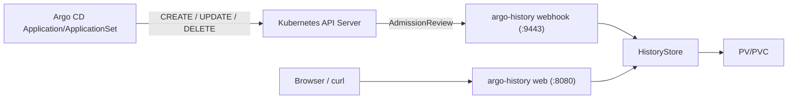

# Argo History Architecture

`argo-history` 是一个独立的 Argo CD 历史备份与查看服务，职责是：

- 通过 admission webhook 监听 `Application` / `ApplicationSet` 的 `CREATE`、`UPDATE`、`DELETE`
- 清洗资源中的无意义字段后，将历史快照保存到持久卷
- 提供 Web 页面和 HTTP API 用于查看、预览、下载历史版本

## 1. 整体架构



运行时只有一个服务进程，同时提供两类入口：

- `:9443`：Webhook TLS 服务
- `:8080`：页面与 API 服务

在 Kubernetes 中会暴露两个 Service：

- `ClusterIP`：给 admission webhook 使用
- `NodePort`：给用户访问页面和 API 使用

## 2. 核心模块

### `src/main.rs`

进程入口，负责：

- 读取 [`config/config.yaml`](/Users/wochong/Documents/code/truth-ai/infras/argo-history/config/config.yaml)
- 初始化 Rustls TLS
- 启动 HTTP 服务和 Webhook 服务
- 注册优雅退出逻辑

### `src/web.rs`

路由与请求处理层，负责：

- 页面路由
- JSON API
- 下载接口
- Admission webhook 入口

### `src/storage.rs`

历史存储核心，负责：

- 清洗资源对象
- 生成备份文件名
- 将备份写入卷
- 查询对象列表、版本列表、具体内容

### `src/admission.rs`

AdmissionReview 请求/响应模型定义。

### `src/model.rs`

领域模型，负责：

- 资源类型 `App` / `AppSet`
- 操作类型 `Create` / `Update` / `Delete`
- 页面/API 输出结构

### `templates/history.html`

服务端渲染页面模板，页面交互模式是：

1. 先看 `App` / `AppSet` 分类
2. 再看对象列表
3. 点击对象后看历史版本列表
4. 默认预览当前版本内容
5. 单独点击下载按钮导出文件

## 3. 备份流程

### 3.1 资源进入 Webhook

当集群内的以下资源发生变化时：

- `applications.argoproj.io`
- `applicationsets.argoproj.io`

且操作类型为：

- `CREATE`
- `UPDATE`
- `DELETE`

Kubernetes API Server 会调用 `argo-history` 的 webhook。

### 3.2 资源选择逻辑

- `CREATE` / `UPDATE`：使用 admission 请求中的 `object`
- `DELETE`：优先使用 `oldObject`，回退到 `object`

### 3.3 内容清洗

当前保留字段：

- `apiVersion`
- `kind`
- `metadata.name`
- `metadata.namespace`
- `metadata.labels`
- `metadata.annotations`
- `spec`

当前会过滤的典型无意义字段：

- `metadata.resourceVersion`
- `metadata.uid`
- `metadata.creationTimestamp`
- `status`
- `kubectl.kubernetes.io/last-applied-configuration`
- `argocd.argoproj.io/refresh`

### 3.4 落盘规则

目录结构：

```text
/var/lib/argo-history/
  apps/
    <namespace>/
      <name>/
        app-create-20260404T022615126Z.yaml
        app-update-20260404T022637770Z.yaml
        app-delete-20260404T022637853Z.yaml
  appsets/
    <namespace>/
      <name>/
        appset-create-20260404T022615071Z.yaml
        appset-update-20260404T022637815Z.yaml
        appset-delete-20260404T022637885Z.yaml
```

文件命名格式：

- `app-create-时间.yaml`
- `app-update-时间.yaml`
- `app-delete-时间.yaml`
- `appset-create-时间.yaml`
- `appset-update-时间.yaml`
- `appset-delete-时间.yaml`

时间格式为 UTC：

```text
YYYYMMDDTHHMMSSmmmZ
```

示例：

```text
app-update-20260404T022637770Z.yaml
```

## 4. 页面访问路径

NodePort 默认端口见 [`chart/values.yaml`](/Users/wochong/Documents/code/truth-ai/infras/argo-history/chart/values.yaml)，当前默认是 `32080`。

常用页面路径：

- `/`
  - 默认重定向到 `/apps`
- `/apps`
  - App 对象列表页
- `/appsets`
  - AppSet 对象列表页
- `/apps/{namespace}/{name}`
  - 查看某个 App 的历史
- `/appsets/{namespace}/{name}`
  - 查看某个 AppSet 的历史
- `/apps/{namespace}/{name}?version={file_name}`
  - 预览某个 App 指定版本
- `/appsets/{namespace}/{name}?version={file_name}`
  - 预览某个 AppSet 指定版本

## 5. 所有 API 接口

下面是当前项目的全部 HTTP 接口。

### 5.1 健康检查

#### `GET /healthz`

用途：

- 容器存活和就绪探针

返回：

```text
ok
```

### 5.2 Web 页面

#### `GET /`

用途：

- 重定向到 `/apps`

#### `GET /apps`

用途：

- 渲染 App 页面和对象列表

#### `GET /appsets`

用途：

- 渲染 AppSet 页面和对象列表

#### `GET /apps/{namespace}/{name}`

用途：

- 渲染指定 App 的历史版本列表
- 默认预览最新版本

Query 参数：

- `version`
  - 可选，指定要预览的文件名

#### `GET /appsets/{namespace}/{name}`

用途：

- 渲染指定 AppSet 的历史版本列表
- 默认预览最新版本

Query 参数：

- `version`
  - 可选，指定要预览的文件名

### 5.3 JSON API

#### `GET /api/v1/apps`

用途：

- 返回所有 App 对象列表

返回示例：

```json
[
  {
    "namespace": "argocd",
    "namespace_key": "argocd",
    "name": "live-app-check",
    "version_count": 4,
    "latest_timestamp": "2026-04-04 02:26:37 UTC"
  }
]
```

#### `GET /api/v1/appsets`

用途：

- 返回所有 AppSet 对象列表

返回示例：

```json
[
  {
    "namespace": "argocd",
    "namespace_key": "argocd",
    "name": "live-appset-check",
    "version_count": 3,
    "latest_timestamp": "2026-04-04 02:26:37 UTC"
  }
]
```

#### `GET /api/v1/apps/{namespace}/{name}`

用途：

- 返回某个 App 的版本列表

返回示例：

```json
{
  "resource": "apps",
  "namespace": "argocd",
  "namespace_key": "argocd",
  "name": "live-app-check",
  "versions": [
    {
      "file_name": "app-update-20260404T022637770Z.yaml",
      "operation": "UPDATE",
      "timestamp": "2026-04-04 02:26:37 UTC"
    }
  ]
}
```

#### `GET /api/v1/appsets/{namespace}/{name}`

用途：

- 返回某个 AppSet 的版本列表

### 5.4 下载接口

#### `GET /download/apps/{namespace}/{name}/{file_name}`

用途：

- 下载某个 App 历史文件

#### `GET /download/appsets/{namespace}/{name}/{file_name}`

用途：

- 下载某个 AppSet 历史文件

#### `GET /api/v1/download/apps/{namespace}/{name}/{file_name}`

用途：

- API 形式下载某个 App 历史文件

#### `GET /api/v1/download/appsets/{namespace}/{name}/{file_name}`

用途：

- API 形式下载某个 AppSet 历史文件

返回头：

- `Content-Type: application/yaml`
- `Content-Disposition: attachment; filename="<file_name>"`

### 5.5 Admission Webhook 接口

#### `POST /webhook/application`

用途：

- 处理 `Application` 的 admission 请求

支持操作：

- `CREATE`
- `UPDATE`
- `DELETE`

#### `POST /webhook/applicationset`

用途：

- 处理 `ApplicationSet` 的 admission 请求

支持操作：

- `CREATE`
- `UPDATE`
- `DELETE`

请求体：

- `admission.k8s.io/v1` `AdmissionReview`

响应体：

- `admission.k8s.io/v1` `AdmissionReview`

处理行为：

- 成功备份后返回 `allowed: true`
- 如果备份失败，则返回 `allowed: false`

## 6. Kubernetes 部署结构

Chart 位于 [`chart`](/Users/wochong/Documents/code/truth-ai/infras/argo-history/chart)。

主要资源：

- `Deployment`
  - 主服务 Pod
- `Service`
  - `argo-history-ui`：NodePort
  - `argo-history-webhook`：ClusterIP
- `ValidatingWebhookConfiguration`
  - 注册 `Application` / `ApplicationSet` webhook
- `Certificate` / `Issuer`
  - cert-manager 生成 webhook TLS 证书
- `PersistentVolume` / `PersistentVolumeClaim`
  - 保存历史快照

## 7. 开发与测试入口

常用命令见 [`Makefile`](/Users/wochong/Documents/code/truth-ai/infras/argo-history/Makefile)：

- `make fmt`
- `make test`
- `make check`
- `make docker-build`
- `make helm-template`
- `make helm-install`
- `make deploy-local`
- `make smoke-test`

其中 `make smoke-test` 会在本地 Orb k8s 上验证：

- `Application` 的 `CREATE/UPDATE/DELETE`
- `ApplicationSet` 的 `CREATE/UPDATE/DELETE`
- 历史 API 返回结果

